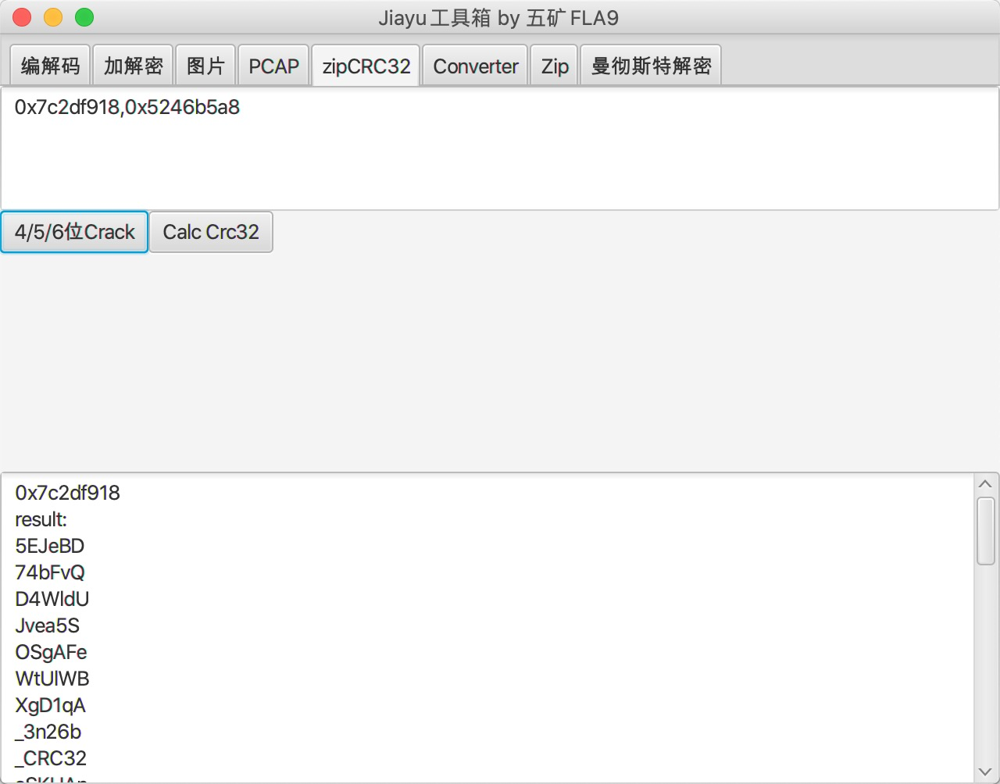

# ctf-tools
网鼎杯培训用到的一些ctf工具(javafx)，编解码，键盘和鼠标抓包解密，维吉尼亚暴力破解，zip crc暴力破解，曼彻斯特解码等。

### 使用方法
https://github.com/isee15/ctf-tools/tree/master/dist/JiayuTools

目录下执行java -jar JiayuTools.jar 

### 界面
</img>
