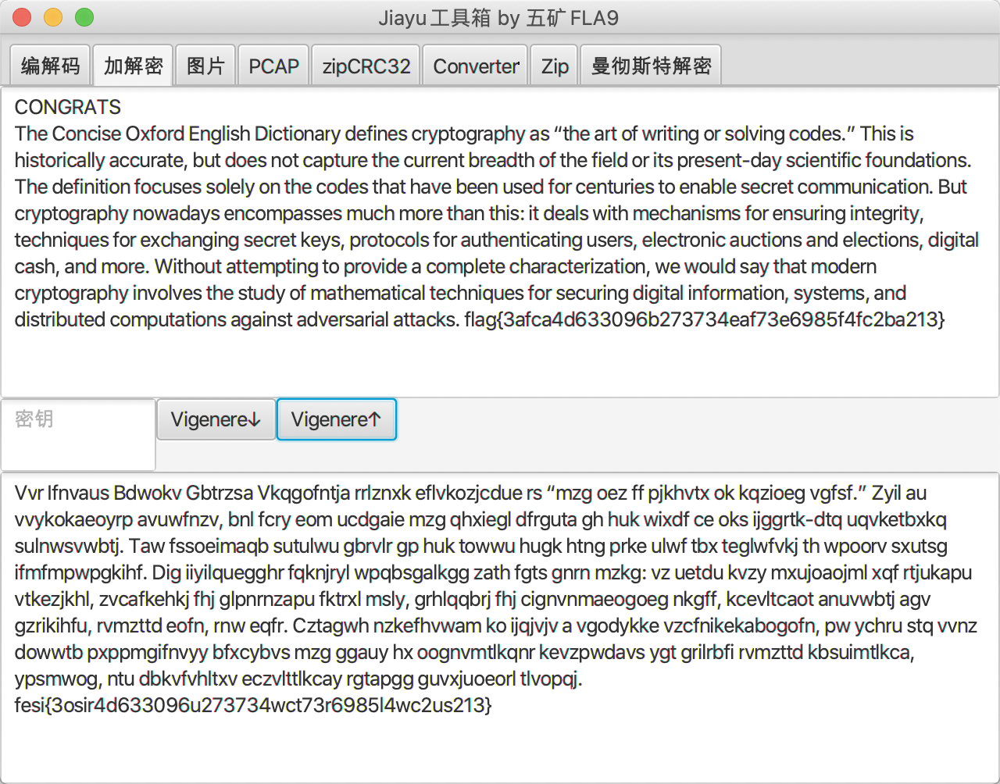

# ctf-tools
网鼎杯培训用到的一些ctf工具(javafx)，编解码，键盘和鼠标抓包解密，维吉尼亚暴力破解，zip crc暴力破解，曼彻斯特解码等。

### 使用方法
https://github.com/isee15/ctf-tools/tree/master/dist/JiayuTools
或者zip包
https://github.com/isee15/ctf-tools/blob/master/JiayuTools.zip

目录下执行java -jar JiayuTools.jar 

### 运行环境
需要JDK8，如果不是JDK8，javafx是单独发布的，需要安装openjfx环境
https://openjfx.io/

### 界面
- 鼠标usb pcap包
</img>
- 维吉利亚密码暴力破解
</img>
- crc暴力
</img>
